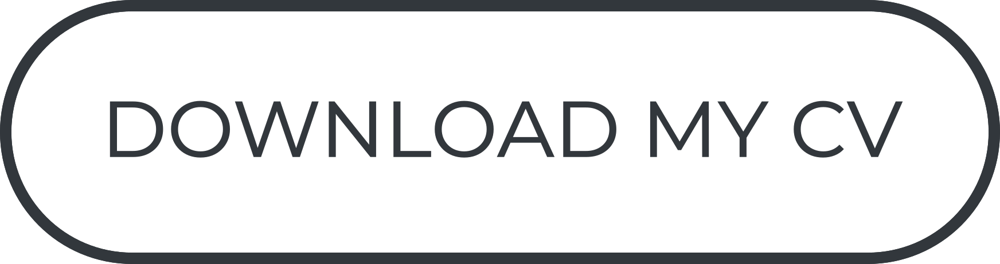
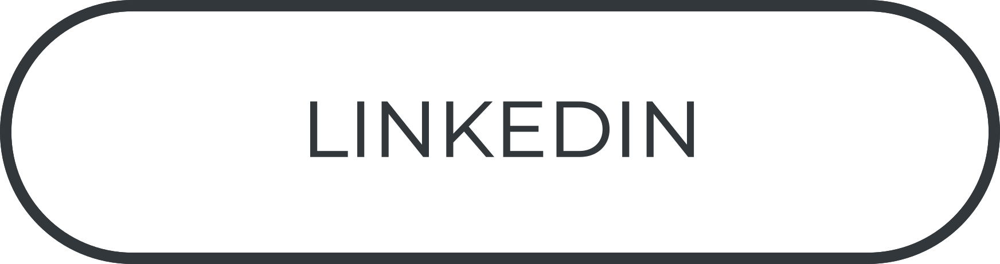
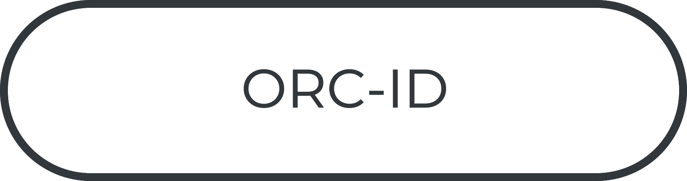

<h1 align="center"> Alberto Rota</h1>
<h3 align="center">Biomedical Engineer </h3>
<h3 align="center">Developing Computer Vision Deep Learning algorithms for Surgical Robotics Applications at Asensus Surgical </h3>
<h3 align="center">Researcher at NEARLab - Medical Robotics Section</h3>

 
<a href="https://nearlab.polimi.it/medical">
<picture>
  <source media="(prefers-color-scheme: dark)" srcset="as_light.png">
   
</picture>
</a> 
<!-- <a href="https://nearlab.polimi.it/medical">
<picture>
  <source media="(prefers-color-scheme: dark)" srcset="bar_light.png">
   
</picture>
</a>  -->
<a href="https://nearlab.polimi.it/medical">
<picture>
  <source media="(prefers-color-scheme: dark)" srcset="nearlogo_light.png">
   
</picture>
</a> 

 
 
 
 
 
 
 
 
 
 
 
 
 
 
 

<a href="https://github.com/alberto-rota/alberto-rota/raw/main/Alberto_Rota_CV.pdf">
<picture>
  <source media="(prefers-color-scheme: dark)" srcset="bcvw.png">
   
</picture>
</a> 
<a href="https://www.linkedin.com/in/albe-rota/">
<picture>
  <source media="(prefers-color-scheme: dark)" srcset="bliw.png">
   
</picture>
</a> 
<a href="https://orcid.org/my-orcid?orcid=0000-0001-9609-6294">
<picture>
  <source media="(prefers-color-scheme: dark)" srcset="borw.png">
   
</picture>
</a> 

  🔬 I developed <a href="https://github.com/alberto-rota/muVES"> μVES </a> to autonomously perform topological and morphological analysis on 3D images of microvascular networks 🔬 

  🫀 I contributed to the devlopment of an <a href="https://github.com/alberto-rota/PAC-PVC-Beat-Classifier-for-ECGs"> AI-based ECG heartbeat calssifier </a> 
to detect ventricular and sopraventricular anomalies 🫀

  🧑‍🔬 I developed <a href="https://github.com/alberto-rota/STEVE"> STEVE</a>, a VR haptic-enhanced surgical robotic simulator for augmented and assisted training 🧑‍🔬 

 🎸 I made a <a href="https://github.com/alberto-rota/LoopStation-DIY-Project"> custom MIDI Loopstation </a> to live loop my guitar 🎸

 🪛 I am a <a href="https://github.com/alberto-rota/Ender3-Upgrade"> maker </a> 🪛

  🌐 I designed and I maintain <a href="https://nearlab.polimi.it"> NEARLab-MRS Website</a> and <a href="https://github.com/NEARLab-MedicalRobotics"> NEARLab-MRS Github </a> 🌐 

