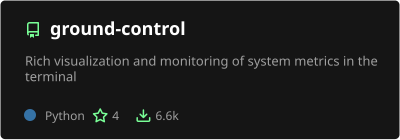
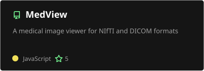

# Alberto Rota

**Visual systems for enhanced awareness in surgical robotics and medical AI**  
Researcher @ [NEARLab](https://nearlab.polimi.it/medical), Politecnico di Milano · Milan, Italy

---

## Research

I develop deep learning and computer vision systems for surgical robotics and medical imaging, from intraoperative perception to surgical training, explainability, and 3D scene understanding.

✨ **[UnReflectAnything](https://alberto-rota.github.io/UnReflectAnything/)** &nbsp;  &nbsp;   
RGB-only specular highlight removal by rendering synthetic specular supervision  
`Synthetic Data` &nbsp; `Image-to-Image` &nbsp; `PyTorch`

🎥 **[SCALE-EM](https://arxiv.org/abs/2512.10379)** &nbsp;   
Self-supervised embeddings for endoscopic scene matching  
`Contrastive Learning` &nbsp; `Endoscopy` &nbsp; `PyTorch`

🔊 **[MESA](https://github.com/FrancescaFati/MESA)** &nbsp;   
Adnexal mass segmentation in ultrasound images  
`DINOv2` &nbsp; `Segmentation` &nbsp; `Ultrasound`

🤖 **[STEVE](https://github.com/alberto-rota/STEVE)** &nbsp;   
VR haptic-enhanced training curriculum for surgical robotics  
`Unity` &nbsp; `C#` &nbsp; `da Vinci Research Kit`

🔍 **[UnderXAI-OVIT](https://github.com/FrancescaFati/UnderXAI-OVIT)** &nbsp;   
Explainable AI decision support for ovarian cancer treatment  
`XAI` &nbsp; `Medical Imaging` &nbsp; `PyTorch`

🩸 **[μVES](https://github.com/alberto-rota/muVES)** &nbsp;   
3D topological and morphological analysis of microvascular networks  
`MATLAB` &nbsp; `Microfluidics` &nbsp; `3D Imaging`

---

## Open Stuff - Terminal Tools - VSC Extensiosns
 

&nbsp;

&nbsp;

&nbsp;

&nbsp;

&nbsp;

 

---
 

 
alberto1.rota@polimi.it · [albertorota.dev](https://albertorota.dev)
 
 
